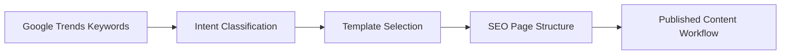
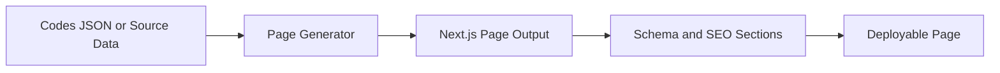
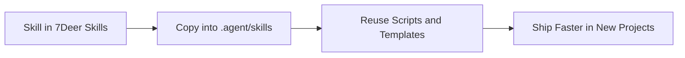

# 7Deer Skills

An open-source skill library for SEO automation, content pipelines, and AI agent workflows.

Built from real project work, this repository packages reusable skills with `SKILL.md` docs, scripts, templates, and references you can copy into your own projects.

[](./LICENSE)
[](#skill-catalog)
[](./CONTRIBUTING.md)

## 中文说明

这是一个面向国内独立出海者的开源技能库，重点服务这些实际场景：

- SEO 自动化和内容站搭建
- AI agent 工作流复用
- Next.js / Python 项目的脚本、模板和技能沉淀
- 游戏站、工具站、内容站的快速启动

这个仓库不是单纯的 prompt 收集，而是把真实项目里反复使用的能力整理成可复用模块。每个 skill 通常都包含：

- `SKILL.md` 使用说明
- 可直接复用的 scripts / templates / references
- 适合复制到项目中的目录结构

如果你正在做独立站、出海内容站、SEO 自动化、AI 工具站，或者想把自己的工作流沉淀成可复用技能库，这个仓库会更适合你。

## Start Here

- Read the [P0 Skills](#p0-skills) first
- Jump to the [Top Use Cases](#top-use-cases)
- Clone the repo from [Quick Start](#quick-start)
- Review [Contributing](./CONTRIBUTING.md) and [Security](./SECURITY.md)

## Why Star This Repo

- Turn Google Trends data into production-ready SEO page workflows
- Generate game code pages in minutes instead of rebuilding the same templates
- Reuse AI agent, scraping, and content automation skills across projects

## What You Get

- `SKILL.md` instructions for each reusable unit
- scripts, templates, and reference files that are usable in real projects
- modular top-level skills you can copy selectively
- a public repo structure designed for reuse instead of one-off project code

## Quick Value

This repository is designed for builders working on:

- AI agent workflows
- SEO automation systems
- content-heavy Next.js projects
- Python automation pipelines
- Roblox and game utility sites

For Chinese indie hackers and solo builders shipping globally, this repo is especially useful for reusable SEO systems, content operations, and project bootstrapping.

## P0 Skills

These are the three strongest entry points in the repository.

| Skill | Input | Output | Best For |
| --- | --- | --- | --- |
| `google-trends-to-pages` | Rising keywords from Google Trends | SEO page plans, intent classification, page structure workflows | SEO content operations |
| `multi-game-codes-hub` | Game codes JSON or structured code data | Production-ready code page templates with SEO structure | Roblox and game sites |
| `roblox-game-data-scraper` | Trello, Discord, Reddit, and game data sources | Structured game data for downstream site generation | Game data collection |

## Top Use Cases

### 1. Google Trends -> SEO Pages

Input:

```text
"yba codes" (+400%)
"how to get fuga in jujutsu infinite" (+90%)
```

Output:

- intent classification
- page type selection
- page structure templates
- SEO-ready content workflow

### 2. Game Codes Data -> Published Page

Input:

```json
{
  "gameName": "Your Bizarre Adventure",
  "gameSlug": "yba",
  "activeCodes": [
    { "code": "GULLIBLE", "reward": "5 Lucky Arrows" }
  ]
}
```

Output:

- code page template
- active / expired code sections
- FAQ schema support
- reusable components for code tables and copy actions

### 3. Raw Community Sources -> Structured Game Data

Input:

- Trello boards
- Discord channels
- Reddit threads

Output:

- normalized data files
- reusable scraping patterns
- downstream inputs for site pages, guides, and update workflows

## Workflow Visuals

### SEO Automation Flow



### Game Codes Flow



### Agent Skill Reuse Flow



## English Summary

7Deer Skills is a reusable library of practical skills extracted from real projects. Instead of starting from scratch, you can reuse agent workflows, SEO automation patterns, content generation modules, scraping utilities, and Next.js/Python building blocks across projects.

## How To Use This Repo

### Use one skill

Copy a single top-level skill directory into your project and follow its `SKILL.md`.

### Use it as a shared skills repo

Clone the whole repository into `.agent/skills` so the same skill set can be reused across projects.

### Use it as a reference library

Browse the scripts, prompts, templates, and references to adapt the parts you need.

## Skill Catalog

### SEO and Content

- `google-trends-to-pages`
- `nextjs-seo-booster`
- `nextjs-seo-foundations`
- `seo-auditor`
- `youtube-content-gen`
- `youtube-game-keywords`

### Data and Research

- `roblox-game-data-scraper`
- `data-scraper-intent`
- `keyword-competition-analysis`
- `youtube-intel`
- `youtube-transcribe`

### Backlinks and Distribution

- `backlink-discovery`
- `backlink-intelligence`
- `seo-backlink-submitter`
- `seo-link-strategy`

### Game and Utility Workflows

- `multi-game-codes-hub`
- `roblox-site-architect`
- `rpg-stat-catalyst`
- `favicon-icon-generator`

### AI Agent and Builder Tools

- `python-agent-engine`
- `gemini-thinking-protocol`
- `plugin-architect`

## Repository Structure

```text
7deer_skills/
|- google-trends-to-pages/
|- multi-game-codes-hub/
|- roblox-game-data-scraper/
|- nextjs-seo-booster/
|- nextjs-seo-foundations/
|- seo-auditor/
|- python-agent-engine/
|- data-scraper-intent/
|- backlink-discovery/
|- backlink-intelligence/
|- seo-backlink-submitter/
|- seo-link-strategy/
|- youtube-content-gen/
|- youtube-game-keywords/
|- youtube-intel/
|- youtube-transcribe/
|- roblox-site-architect/
|- rpg-stat-catalyst/
|- favicon-icon-generator/
|- gemini-thinking-protocol/
|- plugin-architect/
|- .github/
|- CONTRIBUTING.md
|- SECURITY.md
`- LICENSE
```

## Quick Start

### Clone into an Agent Skills Directory

```bash
git clone https://github.com/kennyzir/7deer_skills.git .agent/skills
```

### Add as a Git Submodule

```bash
git submodule add https://github.com/kennyzir/7deer_skills.git .agent/skills
```

### Copy a Single Skill

If you only need one workflow, copy that skill directory into your own project and follow its `SKILL.md`.

## Good First Skills

If you're new to the repository, start with:

- `google-trends-to-pages` for SEO workflow design
- `multi-game-codes-hub` for page generation patterns
- `python-agent-engine` for reusable agent loops
- `nextjs-seo-booster` for lightweight Next.js SEO integration

## How to Evaluate a Skill

Each top-level skill should give you:

- a clear `SKILL.md`
- reusable code or templates
- a practical workflow, not just abstract prompts
- enough structure to adapt it into a real project

## Security Notes

- No real API keys, tokens, or credentials should be committed
- Use placeholders like `your_api_key_here`
- Review `.gitignore` before adding generated reports or project-specific data
- See [SECURITY.md](./SECURITY.md) for reporting guidance

## Contributing

Contributions are welcome. Before opening a pull request:

- keep skills self-contained
- include or update `SKILL.md`
- document required dependencies
- sanitize examples and remove secrets

See [CONTRIBUTING.md](./CONTRIBUTING.md).

## Suggested GitHub Topics

If you want better repository discovery, add these topics on GitHub:

- `ai-agents`
- `seo`
- `nextjs`
- `python`
- `automation`
- `prompts`
- `tooling`
- `content-generation`

## License

MIT License. See [LICENSE](./LICENSE).
